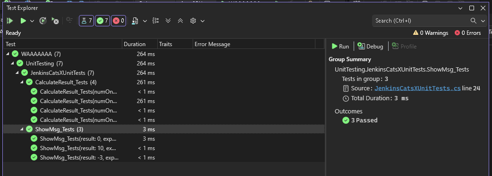
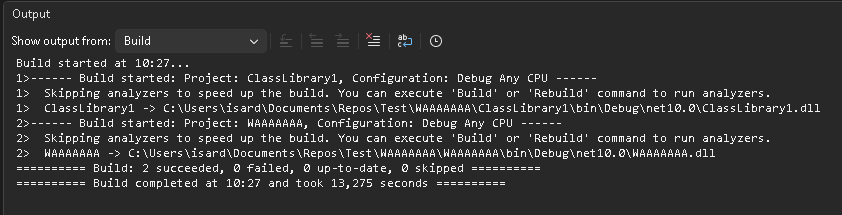

# BLOC2.AC03.JenkinsCats

### Fitxers de codi

- 📄 **[Programa sense refactoritzar](./code/ProgramNoRefactor.cs)**  
  Versió original del programa abans del procés de refactorització.

- 📄 **[Programa refactoritzat](./code/Program.cs)**  
  Versió del programa després d’aplicar les millores de refactorització.

- 📚 **[Classe amb els mètodes de la llibreria](./code/JenkinsCatsClass.cs)**  
  Conté la implementació dels mètodes utilitzats al Program.

- 🧪 **[Tests XUnit utilitzant la classe](./code/JenkinsCatsXUnitTests.cs)**  
  Conjunt de proves unitàries XUnit que validen el funcionament de la llibreria.

---

## Pregunta 1:
**En aquest anàlisi inicial del programa, es mostren resultats en l’apartat de cobertura de codi (coverage)? Raoneu la vostra resposta, incloent una captura de la pantalla de resum de SonarCloud.**
  - No, no es mostren, els resultats de cobertura apareix com 0.0%.
    Apareix 0% ja que és pel fet que el sonnarCLoud l'única cosa que fa és revisar-te el codi sense posar-lo a prova, és a dir que ell sap que aquesta codi está bé, però no sabrà si en la pràctica funcionarà.
    

- [Repositori](https://github.com/szlian/-BLOC2.AC03---Integraci-cont-nua-i-tests-unitaris.git)

## Pregunta 2:
**Quines accions heu realitzat per reduir la complexitat ciclomàtica?  Raoneu la vostra resposta.**

La primera funció calcula un resultat basat en els valors de tres paràmetres enters.
Es sumen els números segons condicions específiques:
  - Si els tres números són positius, sumen els tres.
  - Si numOne i numTwo són positius però numThree és zero o negatiu, suma numOne i numThree.
  - Si només numOne és positiu, retorna numOne.
  - Si numOne és zero o negatiu, retorna 0.

La segona funció retorna un missatge basat en el valor del paràmetre enter 'resultat':
 - Si el resultat és 0, retorna "El resultat és zero".
 - Si el resultat és superior a 0, retorna "El resultat és positiu".
 - Si el resultat és inferior a 0, retorna "El resultat és negatiu".

## Pregunta 3:
**Com separaríeu la lògica de càlcul en mètodes independents?  Raoneu la vostra resposta.**

Separariem la lògica del càlcul en dos mètodes: un per calcular el resultat, retornant el resultat, i un altre on poder mostrar un missatge depenent del resultat, concretament retornar un string amb el missatge, així fem el codi més modular i podrem identificar bugs més fàcilment i refactoritzar millor.

## Pregunta 4:
**Es poden passar tots els tests correctament? Com es captura la sortida per consola? Raoneu la vostra resposta i poseu algun exemple on ho heu implementat.**

Si, tots els test s'han executat correctament:

Sortida per consola:

## Pregunta 5: 
**Quin error ha estat més difícil/complex de solucionar? Raoneu la vostra resposta i poseu algun exemple on ho heu implementat.**

El que més ens va costar va ser configurar correctament l'estructura del projecte perquè GitHub i SonarCloud s'entenguessin. Els punts clau van ser:

El problema principal (Rutes trencades en la Solució): L'arxiu .sln no trobava els projectes a causa d'una discrepància entre les rutes lògiques i les carpetes reals, generant errors de compilació i duplicats.

Solució: Esborrem l'arxiu corrupte i regenerem la solució (.sln) des de zero, verificant manualment les rutes en la consola abans de vincular els projectes.

Configuració del Workflow: GitHub Actions no arrencava perquè la carpeta .github estava oculta dins d'un subdirectori.

Solució: Vam moure la carpeta de configuració a l'arrel absoluta del repositori.

Solució: Modifiquem el script .yml per a incloure el comando dotnet test, permetent que es generin i reportin les mètriques de cobertura

Hem tingut que solucionar és que alhora e configurar el Jenkins en l'Isard hi han botons invisibles, això només passa en el navegador de FireFox, el predeterminat per la màquina d'Isard, i això va alentir la instal·lació. Vam inspeccionar la pàgina i també els vam buscar manualment fins que vam canviar el navegador per veure si era un problema d'aquest últim i resulta que si.

## Classes de equivalència
- Classe 1: El resultat és zero.
- Classe 2: El resultat és positiu.
- Classe 3: El resultat és negatiu.

## Valors limit
Els valors limit per les variables a, b i c son: (-∞, 0 ,∞)

## Casos de prova

| Cas | Nom del cas de prova | Descripció | Entrada | Accions | Resultat esperat | Resultat obtingut |
|-----|----------------------|------------|---------|---------|------------------|-------------------|
| CP1 | Resultat 0 | Comprova que el resultat serà 0 fent que a sigui menor o igual que 0. | a=0 | Verificar que a sigui més petita o igual que 0, assignar el valor 0 al resultat. Mostrar un missatge de que el resultat es 0. | resultat=0, missatge = "El resultat és 0." | |
| CP2 | Resultat a | Comprova que el resultat serà a fent que a sigui major que 0 i b igual a 0. | a=1, b=0 | Verificar que a sigui més gran que 0, que b sigui més petita o igual  a 0 i assignar el valor de a al resultat. Mostrar un missatge de que el resultat es positiu. | resultat=1, missatge = "El resultat és positiu."  | |
| CP3 | Resultat a+b | Comprova que el resultat serà a+b fent que a i b siguin majors que 0 i c igual a 0. | a=1, b=1, c=0 | Verificar que a sigui més gran que 0, que b sigui més gran que 0, que c sigui més petita o igual que 0 i assignar el valor de a+b al resultat. Mostrar un missatge de que el resultat es positiu. | resultat=2, missatge = "El resultat és positiu." | |
| CP4 | Resultat a+b+c | Comprova que el resultat serà a+b+c fent que a, b i c siguin majors que 0. | a=1, b=1, c=1 | Verificar que a sigui més gran que 0, que b sigui més gran que 0, que c sigui més gran que 0 i assignar el valor de a+b+c al resultat. Mostrar un missatge de que el resultat es positiu. | resultat=3, missatge = "El resultat és positiu." | |

## Webgrafia i IA consultada

### Webgrafia:
[Softcatala](https://www.softcatala.org/traductor/)

[Checkpoint](https://www.checkpoint.com/es/cyber-hub/cloud-security/what-is-static-code-analysis/)

[SonnarQube](https://www.sonarsource.com/products/sonarqube/?utm_source=google&utm_medium=cpc&utm_campaign=SQ-EMEA-South-South-Brand&utm_content=Brand-Cloud&utm_term=sonarcloud&s_campaign=SQ-EMEA-South-South-Brand&s_content=172503561991&s_category=Paid&s_source=Paid%20Search&s_origin=Google&cq_src=google_ads&cq_cmp=21283128645&cq_con=172503561991&cq_term=sonarcloud&cq_med=&cq_plac=&cq_net=g&cq_pos=&cq_plt=gp&gad_source=1&gad_campaignid=21283128645&gbraid=0AAAAAC0fKmqGjQP3djWICJgrPciTB8gp5&gclid=EAIaIQobChMIyMLNlf7BkQMV6_J5BB0SGxpMEAAYASAAEgJCjPD_BwE)

### ChatGPT:

  **Prompt:** Pasa este fichero csv a una tabla de markdown.
  
  **Resposta:** Aquí tens el contingut del fitxer CSV passat a taula Markdown (amb les capçaleres correctes): *taula* Si la vols exportar a un fitxer .md, adaptar-la per GitHub, o netejar textos/traduir-los, digues-m’ho.
  
  [Conversa](https://chatgpt.com/share/693ffefd-6848-800f-80a4-15238f252067)

### Gemini AI

  **Prompt:** Generame un .gitignore.
  
  **Resposta:** 

.DS_Store
Thumbs.db
Desktop.ini
$RECYCLE.BIN/

.idea/
.vscode/
*.swp
*.swo
.project
.classpath
.settings/

node_modules/
dist/
build/
npm-debug.log*
yarn-debug.log*
.env

__pycache__/
*.py[cod]
venv/
.venv/
env/

target/
*.class
.gradle/
build/

bin/
obj/

### Deepseek

  **Prompt:** cual comando uso para forzar subida en github?
  
  **Resposta:** Para forzar una subida (push) a GitHub, tienes dos opciones principales. Usa esta tabla para decidir:

Comando	¿Cuándo usarlo?	Explicación
git push -f	Proyecto personal o rama propia. Estás seguro de que nadie ha hecho cambios en esa rama.	Es el atajo corto de --force. Sobrescribe el historial remoto sin preguntar. Usa con cuidado.
git push --force-with-lease	Proyecto en equipo. Es la opción recomendada cuando trabajas con otros.	Fuerza la subida solo si el estado del remoto es el mismo que cuando tú lo descargaste. Previene borrar commits de otros.

[Conversa](https://chat.deepseek.com/share/3kyptuonqppwagekr8)
